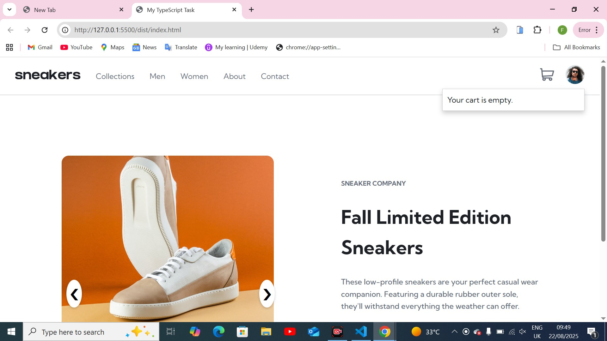
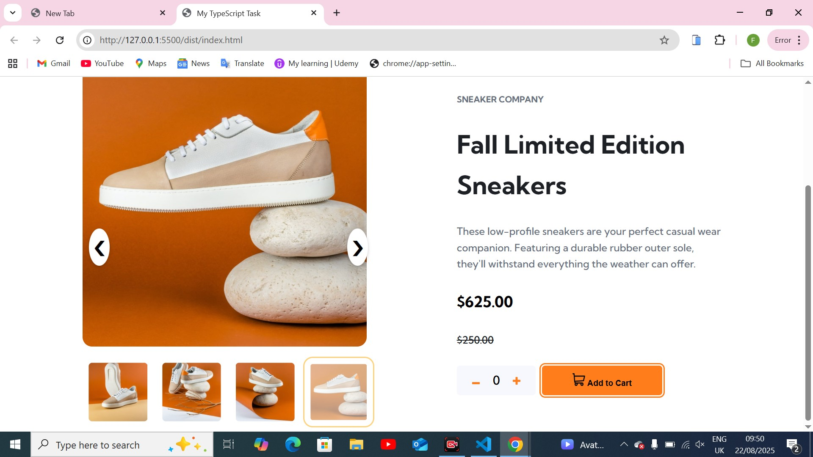
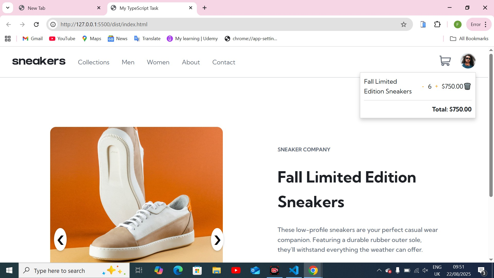
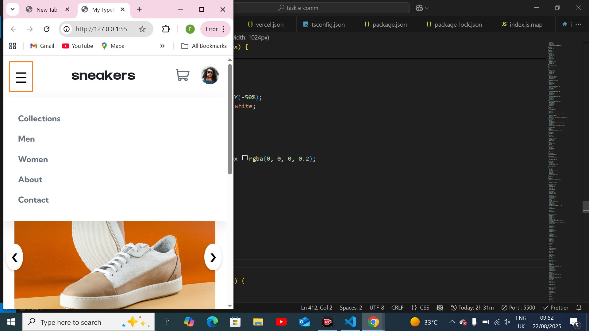

### E-Commerce Product Page

---

A responsive e-commerce product page built with TypeScript, HTML, and CSS.
Includes a mobile-friendly navigation menu, product image gallery with thumbnails, lightbox navigation, and a shopping cart with quantity controls.

---

### Features

- Responsive Navbar – Toggle menu on mobile/tablet
- Product Gallery – Main image, thumbnails, prev/next controls
- Shopping Cart – Add/remove items, adjust quantity, dynamic total
- Active Thumbnails – Highlight current selection
- Lightbox Support (Optional) – View product images in large preview

project-root/
│── dist/ # Public folder (everything runs from here)
│ ├── styles.css # CSS styles
│ ├── index.html # Main HTML file
│ ├── images/ # Product and thumbnail images
│ └── index.js # Compiled JavaScript (from TypeScript)
│
│── src/ # TypeScript source files
│
! ─ index.ts # Main logic (gallery, cart, menu)
│
│── README.md # Project documentation
│── tsconfig.json # TypeScript config

### Getting Started

1. Clone the Repository

---

## bash

git clone https://github.com/your-username/ecommerce-product-page.git
cd ecommerce-product-page

2. Install TypeScript
   npm install -g typescript

3. Compile TypeScript
   tsc

This will generate JavaScript files in the dist/ folder.

4. Run the Project

Just open index.html in your browser

### Demo Screenshots

- Product Gallery with Thumbnails

- Shopping Cart with Quantity Control

- Mobile Menu Toggle

### Built With

HTML5 – Structure

CSS3 – Styling & responsiveness

TypeScript – Interactivity & business logic

### Future Improvements

Add multiple products

Save cart to localStorage

Create a checkout page

Improve accessibility (ARIA labels, keyboard navigation)
